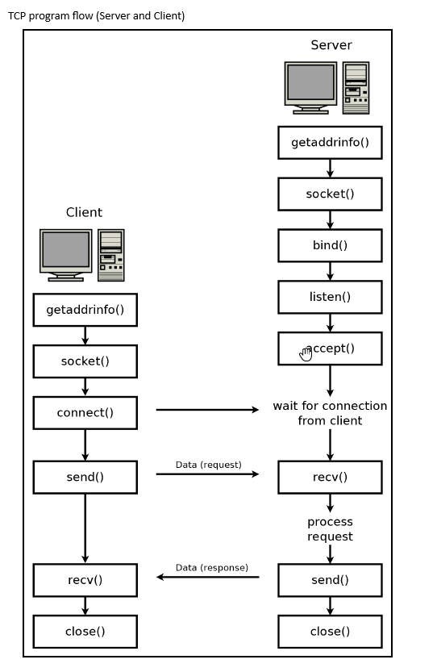
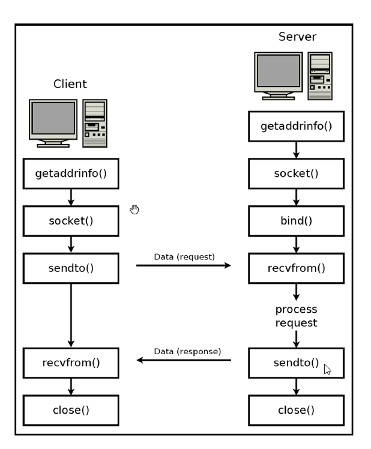

Date range: 8/28/2023 - 9/1/2023

Goals for this Module (Week 2):
    Socket functions
    Socket structures
    Data representation for network programming:
        *Byte order
    Client-Server communication Model

    * Basic TCP client and Server.
    
    * Overview IPv4 and IPv6 and ports.

    *Introduction to what socket programming is, provide an overview of what we aim to accomplish, etc.

    *Code layout for the semester.

    *Environment setup.

Required Reading (see the Books and resources section for links):
    
    [1] "Hacking The Art of Exploitation
        Chapter 4, section 0x420. pages 198 - 203.

    [2] "Hands-On Network Programming with C"
        Chapter 2. Pages: 40- 52

    [3] https://beej.us/guide/bgnet/ 
        Chapter 3 and 4.
    
    If you want a more in-depth explanation, read:
        [4] "UNIX Network Programming: The sockets networking API, 3/e"
        This book is a bit dated but it does provide a more in-depth explanation for some of the functions and structures. Not required to read.

Introduction:
In this section we cover the following topics:
    * Sockets
    * Socket functions
      * Socket functions and 3-way handshake mapping / OSI layer
        * Unix Network Programming  2.6
    * Socket structures
    * Byte order: How data is represented across a network of similar and different architectures
    * Client-Server communication model
      * * Unix Network Programming  2.9

In this module we start to get the lay of the land for how socket programming works, the anatomy of a socket program, and the general flow of a socket server or client program. Armed with this knowledge, we'll be able to explore each of the individual functions in greater detail. A lot of this information has already been covered in the referenced material and I recommend you read those resources.

Anatomy of a Socket Program:
    There are different network programming paradigms, we'll start our journey into socket programming by exploring the Client-Server model and we'll cover the common socket APIs for both TCP and UDP.

    "Network programming is usually done using a client-server paradigm. In this paradigm, a server listens for new connections at a published address. The client, knowing the server's address, is the one to establish the connection initially. Once the connection is established, the client and the server can both send and receive data. This can continue until either the client or the server terminates the connection. A traditional client-server model usually implies different behaviors for the client and server. The way web browsing works, for example, is that the server resides at a known address, waiting for connections. A client (web browser) establishes a connection and sends a request that includes which web page or resource it wants to download. The server then checks that it knows what to do with this request and responds appropriately (by sending the web page)."  [2] Chapter 2. Pg: 47.
    
    * Server:
      * Passively waits for and responds to client connections.
    
    * Client:
      * Initiates the communication
      * Must know the address and port of the server

Socket functions key points:
    
    * The set of networking system calls (socket API or functions) allow a programmer to access the network functionality provided by a system, in this case a Unix system or any system * supporting the sockets API.

    * These system calls are implemented at the kernel level, that is the real functionality is implemented in the kernel. Whenever you call one of these functions, the kernel takes over and does all the work. [3, chapt 5]

    * Whenever a system call is made, the kernel takes over and does all the work for you automagically (sort of).

    * Older text books and legacy code will use most of the APIs covered here but there have been new additions which Beej's guide calls first. As such, we'll follow his guide and make sure to keep that fact in mind whenever we read older code/text books.

    * We'll cover each socket API in the order in which they should be called (man pages are no help on that front)
  
    * One important detail is that sockets in Unix behave like file descriptors. That means, any function that can be used with a file descriptor can be used with a socket.However, there are several functions specifically designed for dealing with sockets.[1 - Chap. 0x0421. Socket functions. pg. 199] 
      * In UNIX, a socket descriptor is represented by a standard file descriptor. This means you can use any of the standard UNIX file I/O functions on sockets.
      * Additionally, in UNIX, all file descriptors (and therefore socket descriptors) are small, nonnegative integers.

While most books and tutorials jump right into the coding, I think covering the different socket APIs and explaining the flow of writing a socket application might serve us better. Socket programming requires more than simply calling multiple APIs, it requires an understanding of different C-Structures as well as data representation in order to write an application. We'll slowly peel the onion. 

[It might be better to write a small TCP server making use of all these functions.]

Socket APIs: We'll cover each of these functions in greater detail in a later model. You can learn more about this functions by running the man command on any *Unix system. i.e.: "man socket"

    getaddrinfo():
        * This API helps set up the structures that will be needed whenever we're writing any program making use of the socket API set. It provides a protocol-independent manner of working with hostnames and addresses.
          * Note: prior to getaddrinfo(), programmers would have to call gethostbyname() to perform DNS lookup. They would then have to manually load the results into a struct sockaddr_in (more on this later) and use it in their function calls. getaddrinfo() automates those steps. You will inevitately see code written this way, especially in legacy code.
    
    getnameinfo():
        * provides a protocol-independent manner of working with hostnames and addresses.
    
    socket():
        * Creates and initializes a new socket.

    Bind():
        * Associates a socket with a particular IP address and port number.

    listen():
        * is used on the server to cause a TCP socket to listen for new connections.

    connect():
        * is used on the client to set the remote address and port. In the case of TCP, it also establishes a connection.

    accept():
        * is used on the server to create a new socket for an incoming TCP connection.
    
    send() and recv()
        * are used to send and receive data with a socket, usually a SOCK_STREAM socket.
    
    sendto() and recvfrom()
        * are used to send and receive data from sockets without a bound remote address, usually a SOCK_DGRAM socket.
    
    close():
        * Used to close a socket. In the case of TCP, this also terminates the connection.
    
    shutdown():
        * is used to close one side of a TCP connection. It is useful to ensure an orderly connection teardown.
    
    select():
        * is used to wait for an event on one or more sockets. Allows multiplexing.

    setsockopt():
        * is used to change some socket options.
    
    fcntl():
        * Also used to get and set some socket options.

    [3 - chapter 5]
    [2 - chapter 2. page 46]

For the most part, TPC/UDP applications wriiten in the Server-Client paradigm will follow the set of steps presented in the images below. We can use these two diagrams as an aid to remember how to structure our socket application following that model. We can see how the previously covered socket APIs are called and used through the application life cycle.

Flow of a TCP server/client program:
    

Flow of UDP server/client program:
    

Network Byte Order and related functions: These Socket APIs are used to transmit data across networks using different byte orderings.

    There are two common ways to write bytes on a computer system, Big-Endian and Little-Endian, both of which refer to whether the least or most significant byte is the trailing byte in a message.
    
    We'll use the two byte hexadecimal string: 0xb34f as our sample string.
    
    Big-Endian (also known as Network Byte Order):
        * This is the commonly agreed upon byte ordering where bytes are represented in the sequence you'd expect for our example string. That is, 0xB34F is represented as 0xB3, 0x4F on an Big-Endian system.
    
    Little-Endian (known as Host Byte Order):
        * Stores the bytes in reversed order, that is the string 0xB34F would be stored in memory as the sequential bytes 0x4F followed by 0xB3. There are computer systems and processors which use this data representation method.
    
    Also keep in mind that numbers are represented in two different ways: short (two bytes) and long (four bytes) and they need to be converted or handled appropriately whenever you send data over a network. 
    
    As we can expect, having two different data representation methods poses a problem when transmitting data over a network. To overcome this issue, the socket API provides a set of API to convert between the different data representation methods. The big point we're trying to make here is that you'll want to convert your data to Network Byte Order as you send out over the network and likely convert it to Host Byte Order when you receive it on the endpoint (depending on the processor: Intel vs other processors, etc.).

    Functions:
        Read [1 -  Chap 0x423. pages: 202 - 203]

        htonl(long value) Host-to-Network Long:
          * Converts a 32-bit integer from the host’s byte order to network byte order
          
        htons(short value) Host-to-Network Short:
            * Converts a 16-bit integer from the host’s byte order to network byte order
        
        ntohl(long value) Network-to-Host Long:
            * Converts a 32-bit integer from network byte order to the host’s byte order

        ntohs(long value) Network-to-Host Short:
            * Converts a 16-bit integer from network byte order to the host’s byte order

        For compatibility with all architectures, these conversion functions should still be used even if the host is using a processor with big-endian byte ordering.

Socket addresses and related Structures:
    The last bit of information we need before writing a simple socket application is the structures used by the socket APIs to represent network addresses.

    Many of the socket functions reference a sockaddr structure to pass address information that defines a host. This structure is also defined in bits/socket.h
    
    These structures are better documented and explained in the reading material, I'll list the common socket structures here but you are expected to read the material for a more comprehensive explanation.
    
    Required reading for socket structures:
        [3 - Chapter 3.3 ]
        [1 - Chatper 4, section 0x422]
        [4 - Chapter 3, section 3.2]
            * This book is a bit older so it might not cover some of the newer structures but it provides a more in-depth explanation of the structures.
    
    struct addrinfo:
        * This structure is a more recent invention, and is used to prep the socket address structures for subsequent use. It’s also used in host name lookups, and service name lookups: getaddrinfo() and getnameinfo().

    struct sockaddr{ ... }
        * This structure describes a generic socket address and holds socket address information for many types of sockets.
    
    struct sockaddr_in{ ... } & struct sockaddr_in6:
        * Structure describing an Internet socket address.
        * This structure makes it easy to reference elements of the socket address.
    
    struct sockaddr_storage:
        * designed to be large enough to hold both IPv4 and IPv6 structures.
        * Used when you don't know in advanced if the API call will fill your structure with an IPv4 or IPv6 address.

Legacy code:
    Explain how things were done before and what we can skip / avoidin modern network programming.

## Sources ##
Books and resources:

[1] "Hacking The Art of Exploitation, 2nd Edition", by Jon Erickson. No Starch press, 2008.
        https://learning.oreilly.com/library/view/hacking-the-art/9781593271442/

[2] "Hands-On Network Programming with C" Lewis Van Winkle. Packt Publishing, 2019.
        https://learning.oreilly.com/library/view/hands-on-network-programming/9781789349863/

[3] "Beej's Guide to Network Programming: Using Internet Sockets", by Brian "Beej Jorgensen" Hall, independently published April 2023.
        https://beej.us/guide/bgnet/

[4] "UNIX Network Programming: The sockets networking API, 3/e", by W. Richard Stevens, Bill Fenner, and Andrew M. Rudoff. ISBN-10: 0131411551. ISBN-13: 78-0131411555. Addison-Wesley.
        https://learning.oreilly.com/library/view/the-sockets-networking/0131411551/
