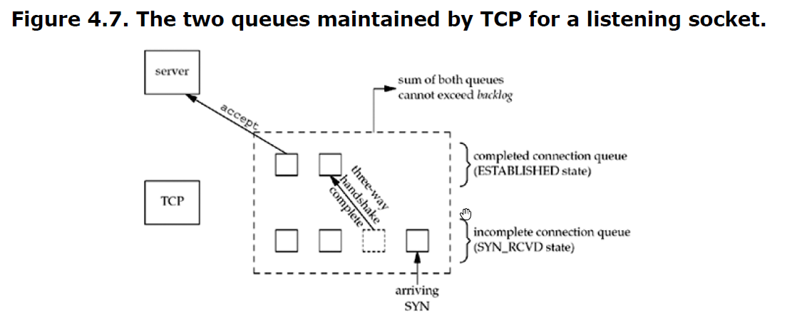
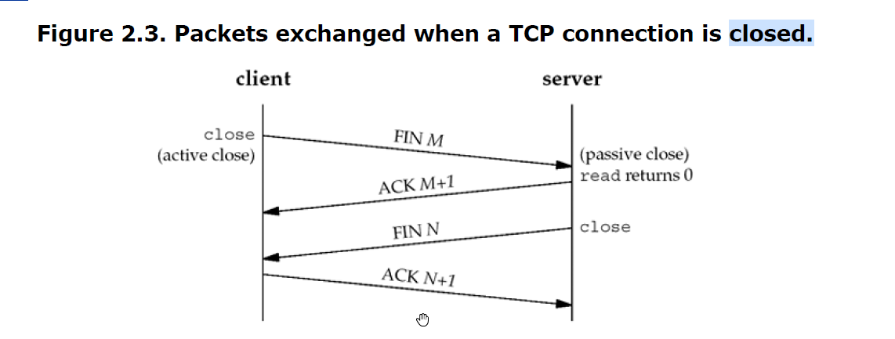

In the previous module we covered the main socket structures we'll be using through the course. We're now ready to start learning about the different socket functions and start writing simple socket applications. 

In this module we'll learn about the elementary socket functions required to write a complete TCP client and server.

First, we'll cover each function and develop a client and server program. 

We'll refer to the TCP Program flow document throughout this module.

The general flow of a TCP a server, follows the set of steps:
    1. Declare and initialize the relevant socket structures (covered in the previous module) using getaddrinfo() or similar.
    2. Instantiate a socket file descriptor using the socket() function.
    3. Bind our socket to an interface or all interfaces using the bind() function.
    4. Put the socket in a listening state using the listen() function.
    5. Accept remote connections on the given socket (address and port pair) using the accept() function.
    6. Receive and/or send information (depending on the server's functionality) using the recv() and send() functions, respectively.
    7. Finally, teardown/close the connection using the close() function.

The course resources do a great job at explaining each of the socket functions, recommend reading those. We'll make note of each function here and try to add information we thought was lacking or try to clarifying sticking points. 

Even though we're starting out with TCP (STREAM_SOCKS), these functions are the same for both TCP and UDP programs. The information presented in the next set of modules applies to both types of sockets, with a few sections and we'll make a note of those where applicable.

* Chapter 5.2 - 5.9 from Beej's briefly covers each of these functions and the student is required to read that chapter.
* Chapter 4.1 - 4.6, and 4.9 from Unix Network Programming, provides an in-depth discussion of each of these functions. 
* Chapter 0x421 from HAO provides a quick reference for each of these functions but doesn't provide as much information as the other two books.

The socket() function:
To perform network I/O, the first thing a process must do is call the socket function to specify the type of communcation (protocol) desired. The socket function provides this functionality.

    socket(int domain, int type, int protocol):
        * Purpose: used to create and initialize a new socket, (communication channel between endpoitns), returns a file descriptor for the socket or -1 on error.
        * This function just creates the interface and returns the FD assigned to it.
    
    Parameters: The parameters for this function allow you to specify what kind of socket you want to use, protocol, etc.

        domain (you might see family instead in older literature or legacy code):
            * This parameter specifies the address family, which determines the type of addresses the socket can communicate with.
              * IPv4 vs IPv6, for example.

            * Possible values:
            It can be one of the following:
              * AF_INET: for IPv4 protocols
              * AF_INET6: for IPv6 protocols.
              * AF_UNSPEC: allows the system to choose the appropriate family based on available resources.
              * AF_UNIX: Unix sockets for local communication.

        type: The type of socket to use for the connection/socket.
            SOCK_STREAM for TCP.
            SOCK_DGRAM for UDP.
            SOCK_RAW for raw sockets.
            Others, as supported.

        protocol: The protocol to use. 
            * it can be TCP, UDP, or other. 
            * Although it is generally set to zero (0) to let the system choose the default protocol for the given address family and socket type.

    Returns:
        On success, returns a non-negative integer value for the socket file descriptor or -1 on error.

    Notes:
    
    domain is tightly coupled with protocol because each domain (protocol family), supports its own set of protocols.
    for example, AF_INET can support both TCP and UDP and will use either SOCK_STREAM or SOCK_DGRAM.

    AF_XXX vs PF_XXX:
        Undoubtedly, you will see either AF_INET or PF_INET used for the domain argument used in the socket() function. so here is the explanation behind it:
        
        "The "AF_" prefix stands for "address family" and the "PF_" prefix stands for "protocol family." Historically, the intent was that a single protocol family might support multiple address families and that the PF_ value was used to create the socket and the AF_ value was used in socket address structures. But in actuality, a protocol family supporting multiple address families has never been supported and the <sys/socket.h> header defines the PF_ value for a given protocol to be equal to the AF_ value for that protocol. While there is no guarantee that this equality between the two will always be true, should anyone change this for existing protocols, lots of existing code would break." [Unix Network Programming - 4.2, pg 133]

    Older code will hardcode the arguments to socket while modern code will use addrinfo's ai_family, ai_sockettype, and ai_protocol to populate these values.
        socket(AF_INET, SOCK_STREAM, 0) vs socket(res->ai_family, res->ai_socktype, res->ai_protocol), where res is an addrinfo structured populated by getaddrinfo().

    
The bind() function:It binds a socket so it can listen for incoming connections.
    Once a socket has been created with socket(), we use bind() to associate a socket with a port on the local machine. That is, we bind the pair to the interface. This call is usually followed by the listen() function on server applications.

    int bind(int sockfd, struct sockaddr *my_addr, int addrlen):
    
    Parameters:
        sockfd: socket file descriptor returned by socket()
        
        struct sockaddr *my_addr:
            * A pointer to a protocol-specific address. This is a structured pre-populated by a call to getaddrinfo().
        
        addrlen: the size of the sockaddr structure.

    Returns: 0 on success or -1 on failure.

    Notes:
    * We can specify the port to bind the socket to by supplying the number to the "service" parameter for getaddrinfo().
    * On a system with multiple addresses, we can tell bind() which address to by to by specifying the address in the "node" paremeter for getaddrinfo().
      * Bind is usually called by server programs and not by clients. If bind() is not invoked, the kernel will choose an ephemeral port for the client application.
      * For a TCP client, bind will assign the source IP address that will be used to deliver the IP datagrams.
      * For a TCP server, we can restrict the socket to listen or accept connections on a specific interface/address.
      * For TCP clients, we can use bind() to specify which interface our packets should be sent out of. In the infosect world this is useful in networks where network traffic to certain devices might be limited to specific source networks. 
        * Picture a system with multiple interfaces/addresses, such as 192.168.1.2 and 172.16.2.2 for interfaces A and B, respectively. If we are trying to reach a network that requires that we come from the 172.x address, we can use bind to make sure our traffic is sourced from this network. Traffic tunneling applications such as network use bind() in this fashion.
    * For **servers**, this port is used by the kernel to track and match incoming packets to a process' socket descriptor. 
      * This is important because a server application can handle multiple client connections on the same port.

The connect() function:
    The connect function is used by a TCP client to establish a connection with a TCP server.
    
    * The client does not have to call bind before calling connect. The kernel will choose the appropriate interface and an ephemeral port.
    * For a TCP socket, connect() initiates TCP's three-way handshake.
      * SYN
      * SYN/ACK
      * ACK
    
    int connect(int sockfd, const struct sockaddr *addr, socklen_t addrlen);

    Parameters: The parameters are the same type we've used in the previous functions, the only difference is that the sockaddr *remote_addr must contain the IP address and port number of the remote host.
        sockfd: socket file descriptor returned by socket()
        
        struct sockaddr *remote_addr:
            * A pointer to a protocol-**specific** address. This is a structured pre-populated by a call to getaddrinfo().
        
        addrlen: the size of teh sockaddr structure.

    Returns: The function returns only when the connection is established or an error occurs. Returns 0 on binding or connection success, -1 on failure. errno is set to indicate the error number. It's good practice to check errno.

The listen() function: 

    * Used by server applications or applications listening for incoming connections.
    * Usually called after the socket() and bind() functions and must be called before accept().
    * This function performs two actions (see active vs passive sockets below):
      * Puts the socket in a state where it listens for new connections (from closed to listen).
      * It specifies the maximun number of connections the kernel should queue for this socket (see backlog below).
    
    int listen(int sockfd, int backlog):
    Parameters:
        sockfd: is the usual socket file descriptor returned by socket().
        
        backlog: is the number of connections allowed on the incoming queue.

    Active vs Passive sockets:
        When a socket is created with socket(), it is assumed to be an active socket (the application will issue a connect). listen() converts the socket from active to passive.

        * Active: known as a client socket, typically used to initiate a connection to a remote server.
        * Passive: Known as a server socket, used to wait for connections

    backlog (see 4.4 from Unix Network Programming):
        * This is the number of connections that will be put in a queue until accept() sees them and acts on them.
        * Two queues exist:
          * Incomplete connection: contains an entry for each SYN packet that has arrived from a client.
          * Completed connection: contains an entry for each client with whom the TCP three-way handshake has completed (established connection).

        

    
The accept() function:
It's called by a TCP server to return the next completed connection from the front of the completed connection queue. (completes a connection from a remote client.)

    * By default, it blocks until a new connection is made (the program will sleep until a connection is made to the listening socket).
    * When a connection is made it creates a new socket for it. 
      * The listening socket will remain listening and the new socket will be used to handle the received connection for the given client.
      * The original socket used for the calls to bind and listen is called the listening socket while the new socket returned by accept() is called the connected socket.
      * New file descriptor is created by the kernel.
        * it creates a socket for each connection that is accepted.
      * This new socket can be used to send and receive data.
      * accept() fills the sockaddr *addr structure with the remote system's address and port.
    * The socket is closed when the server is finished serving a given client.

    int accept(int sockfd, struct sockaddr *addr, socklen_t *addrlen):
    Parameters:
        sockfd:
            * is the usual socket file descriptor returned by socket().

        struct sockaddr *addr:
            * A struct sockaddr_storage is more commonly used, we cast it to (struct sockaddr *)
            * Used to return the protocol address of the connected peer (address + port).

        addrlen: The value indicating the size of the returned structure. (size of struct *addr)

    Returns: 0 on success or -1 on failure and sets errno to the error number.
        Returns up to three values:
            * An integer value that is either new socket or an error indication
            * The protocol address of the client process
            * the size of this address

The send() function:
    "Sends len bytes from *msg to socket sockfd. "

    This function takes the client's socket, a pointer to the data to be sent, and the length of the data to send.

    int send(int sockfd, const void *msg, int len, int flags);
    Parameters:
        * sockfd is the usual socket file descriptor returned by socket().
        * *msg : is a pointer to the data  you want to send.
        * len : is the length of the data in bytes.
        * flag: flags for I/O functions, can usually be set to 0. See man pages for more details.

    Returns: 
      * The number of bytes actually sent out (might be less than the number it was told to send).
      * or -1 on error, errno is set.

The recv() function:
    "Receives len bytes from socket sockfd into *buf. "

    This function is similar to send() but it receives data instead of sending it.
    Data is read from sockfd into *buf, len is the maximum length of the buffer.

    int recv(int sockfd, void *buf, int len, int flags)
    Parameters:
      * sockfd is the usual socket file descriptor returned by socket().
      * *buf : is a pointer to the buffer to read the data into (write to).
      * len : is the length of the data in bytes.
      * flag: flags for I/O functions, can usually be set to 0. See man pages for more details.

    Returns:
      * The number of bytes received.
      * 0 if the remote side has closed the connection.
      * Or -1 on error, sets errno.

The close() function:
    This is the normal Unix close function and it is used to close a socket and terminate a TCP connection.

    * default behavior is to mark the socket as closed and return to the process immediately.
    * Makes the socket descriptor no longer usable by the process. It cannot be used with any of the I/O operation functions.
    * TCP will still try to send data queued to be sent to the other end and after it completes, the normal TCP conenction termination sequence takes place.
      * 

    close(sockfd):
      * sockfd is the usual socket file descriptor returned by socket().

    Returns:
    
    Notes:
        When a process closes the connected socket, it decrements the reference count for the descriptor. If there are multiple references for a given socket, a single close() call to it won't close it or shut it down and no TCP connection termination will take place.
            * the shutdown() (see below) function will forcebly close the connection.
    
The shutdown() function:
    Gives more control over how a socket closes. It allows you to cutr off communication in a certain direction or both. It doesn't actually close the file descriptor but rather changes its usability.

    int shutdown(int sockfd, int how)
    Parameters:
        * sockfd: is the usual socket file descriptor returned by socket().
        * how: 
          * 0 : further receives disallowed
          * 1: further sends are disallowed.
          * 2: further sends and receives are disallowed (same behavior as close())

    Returns: 0 on success, -1 on error and sets errno.

@TODO:
    Explain how SYN, ACK, SYN/ACK, FIN, and RST packets are sent by each of these functions.

The getpeername() function:
    Returns the protocol address associated with the remote socket(IP address of remote endpoint).

    int getpeername(int sockfd, struct sockaddr *addr, int *addrlen):
    Paremeters:
      * sockfd: is the usual socket file descriptor returned by socket().
      * addr: is a pointer to a struct sockaddr (or a struct sockaddr_in) that will hold the information about the other side of the connection.
      * addrlen: is an integer representing the size of sockaddr *addr.

    Returns: -1 on error, sets errno.

    Once the address is returned in *addr, you can use inet_ntop(), getnameinfo(), or gethostbyaddr() to print or get more information.
    @TODO: cover these functions at some point.

This concludes our overview of the network APIs for a TCP server/client application.
    
