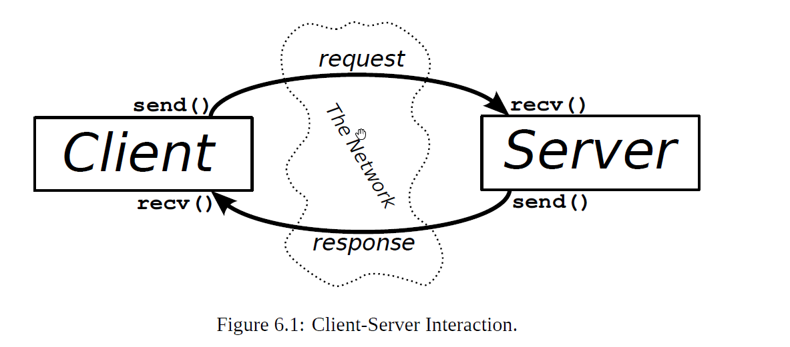
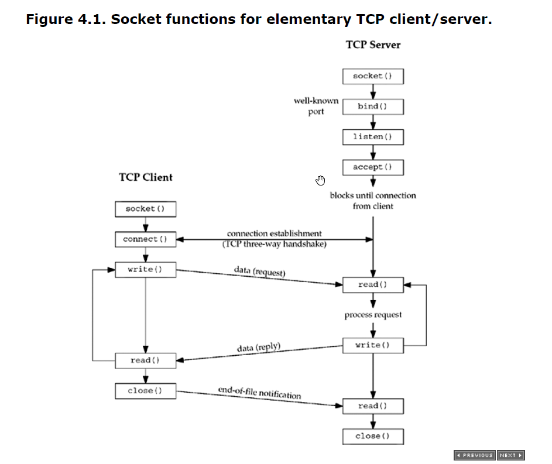
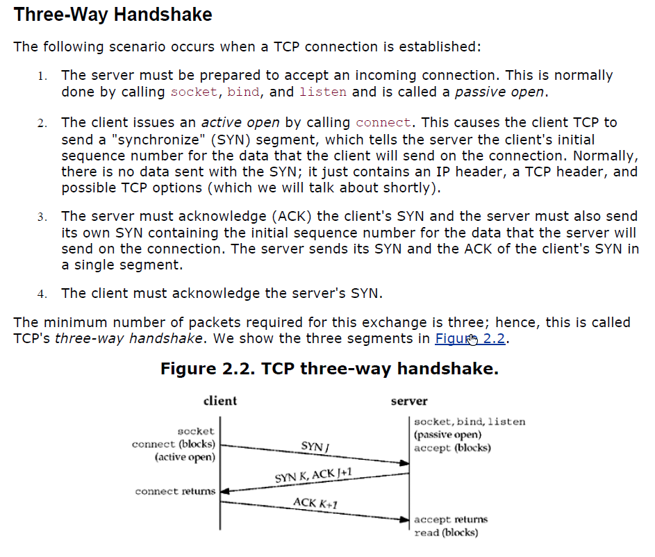
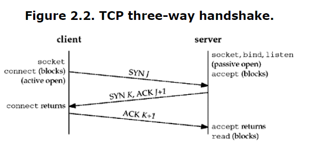
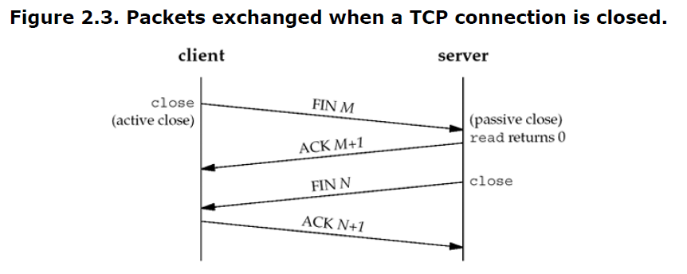

Moving forward, we want to start doing things a bit different as far as how we organize our code. Using C we can make use of header files to make our code re-usable through libraries. Using C++ we can do the same through encapsulation and classes.

A lot of the code in our examples becomes repetitive in the sense that we find ourselves writing the same code over and over with minor modifications. While this type repetition is great to learn programming, and socket programming, at some point we want to move forward and start learning more advanced concepts. Repetition of code, I think, might take away from making the most of our time. Up to this point, we have probably written 3-5 socket applications for both TCP and UDP and we understand the basic flow of a TCP or UDP client or server which lends itself for a great opportunity to abstract those bits of our code into a set of re-usable libraries. Feel free to continue to work through the examples the same way the books do, that is writting each program every time, or take the same approach I have, writing libraries for our tasks as we master each topic.

    This is a general lay out of our-files. These libraries will be refined as we learn new material.
    Classes/libraries:
        Socket 
            Implements the common functionalities of creating a socket, initiliazing the relevant data structures, protocols, and families.
            Constructors will create a socket object for one of the given protocols: TCP or UDP.
        
        TCP
            Implements the common functionality of a TCP client or server using sockets.
            Constructors will create a socket object/class using the common parameters for a TCP socket.

        UDP
            Implements the common functionality of a UDP client or server using sockets.
            Constructors will create a socket object/class using the common parameters for a UDP socket.

        Utilities
            Implements all the code and functionality to make our programs platform agnostic / support for cross-platform  (Linux + Windows).

TCP Client - Server Notes

The diagram summarizes the exchange of information between client and server:

Three applications will be written:
    1. simple TCP server + client.
    2. Server using the fork() model, explain its limitations.
    3. Server using multiplexing with select().

Chatper 5 - Unix Network Programming

Besides running our client and server in their normal mode (type in a line and watch it echo), we examine lots of boundary conditions for this example:
    * what happens when the client and server are started
    * what happens when the client terminates normally
    * what happens to the client if the server process terminates before the client is done
    * what happens to the client if the server host crashes; and so on.

 By looking at all these scenarios and understanding what happens at the network level, and how this appears to the sockets API, we will understand more about what goes on at these levels and how to code our applications to handle these scenarios.

 

 To aid in our understanding of the connect, accept, and close functions and to help us debug TCP applications using the netstat program, we must understand how TCP connections are established and terminated, and TCP's state transition diagram.

 

 Three-way handshake
 The following scenario occurs when a TCP connection is established:
  1. The server must be prepared to accept an incoming connection. This is normally done by calling socket, bind, and listen and is called a passive open.
  2. The client issues an active open by calling connect. This causes the client TCP to send a "synchronize" (SYN) segment, which tells the server the client's initial sequence number for the data that the client will send on the connection. Normally,  there is no data sent with the SYN; it just contains an IP header, a TCP header, and possible TCP options (which we will talk about shortly).
  3. The server must acknowledge (ACK) the client's SYN and the server must also send its own SYN containing the initial sequence number for the data that the server will send on the connection. The server sends its SYN and the ACK of the client's SYN in a single segment.
  4. The client must acknowledge the server's SYN.
    

TCP Connection Termination:
While it takes three segments to establish a connection, it takes four to terminate a connection.
 1. One application calls close first, and we say that this end performs the active close. This end's TCP sends a FIN segment, which means it is finished sending data.
 2. The other end that receives the FIN performs the passive close. The received FIN is acknowledged by TCP. The receipt of the FIN is also passed to the application as an end-of-file (after any data that may have already been queued for the application to  receive), since the receipt of the FIN means the application will not receive any additional data on the connection.
 3. Sometime later, the application that received the end-of-file will close its socket. This causes its TCP to send a FIN.
 4. The TCP on the system that receives this final FIN (the end that did the active close) acknowledges the FIN.

* Since a FIN and an ACK are required in each direction, four segments are normally required. We use the qualifier "normally" because in some scenarios, the FIN in Step 1 is sent with data. Also, the segments in Steps 2 and 3 are both from the end performing the passive close and could be combined into one segment.
  

    * INADDR_ANY : wildcard address, is there a newer method of doing this?
    * listen() will convert a socket from socket() into a listening socket.
    * the server blocks in the call to accept(), that is it goes into a sleep/wait state, waiting for a client connection to complete.
    * 

Notes from the simple TCP server.

The server blocks when it accept() or recv(), the program will idle until a connection is accepted or data is received. If we want our program to be interactive or perform other tasks while this is happening, it won't be able to do it that as written.

We demonstrated how to use the socket() APIs to write a simple TCP server and client.

We can write another version of each
    Server can loop for multiple connections