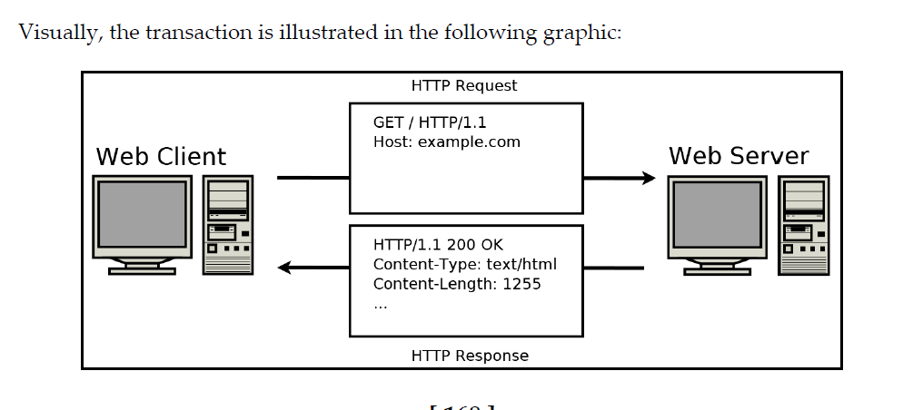
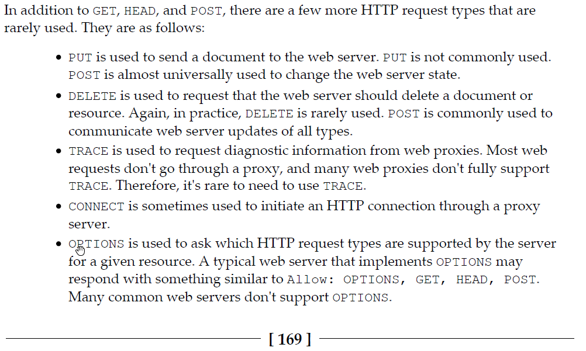
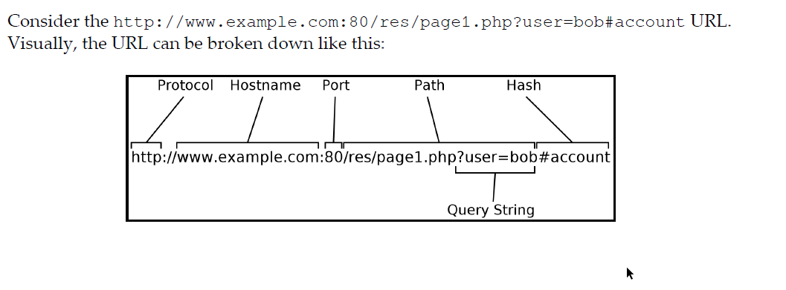

This module will cover the HTTP protocol, HTTP message format, requests, HTTP codes, and server/client operations. 

•	[1] Lewis Van Winkle, “Hands-On Network Programming with C". Packt Publishing. May 2019. ISBN: 9781789349863. https://learning.oreilly.com/library/view/hands-on-network-programming/9781789349863/
  o	Read chapter 6 and 7.
•	[2] Brandon Rhodes, John Goerzen, “Foundations of Python Network Programming, Third Edition”. Apress. August 2014. https://learning.oreilly.com/library/view/foundations-of-python/9781430258551/
  o	Read chapter 7, 9, 10. 
•	In addition to the textbook, this is another great resource for the topics covered: https://developer.mozilla.org/en-US/docs/Web/HTTP/Messages


What is HTTP?

    https://datatracker.ietf.org/doc/html/rfc7230

    HTTP is a text-based client-server protocol that runs over TCP over port 80.
    
    HTTP works by first having the web client send an HTTP request to the web server.
    The web server responds with an HTTP response.
    
    HTTP requests  indicate which resource the client is interested in, and the HTTP response delivers the requested resource.
Visual representation:



Content from [Foundations of Python Programming,chapter 9.]

HTTP Server-Client architecture: [Foundations of Python Programming Book]
  * The client always initiates the connection, in the form of a request for some resource.
  * Once the request has been made, the client wait until it receives a response from the server.
  * In HTTP 1.1, No further requests are permitted over the same socket until the response is finished.

HTTP Requests and Responses: 

Both the request and the response are called an HTTP message in the standard, and each message is composed of three parts.
  * A first line that names a method and document in the request and names a return code and description in the response. The line ends with a carriage return and linefeed (CR-LF, ASCII codes 13 and 10).
  
  * Zero or more headers that consist of a name, a colon, and a value. Header names are case-insensitive, so they can be capitalized however a client or server desires. Each header  ends with a CR-LF. A blank line then terminates the entire list of headers—the four bytes CR-LF-CR-LF that form a pair of end-of-line sequences with nothing in between them. This blank line is mandatory whether any headers appear above it or not.
  
  * An optional body that immediately follows the blank line that end the headers. There are several options for framing the entity, as you will learn shortly.

The first line and the headers are each framed by their terminal CR-LF sequences, and the whole assembly is framed as a unit by the blank line at the end, so the end can be discovered by a server or client by calling recv() until the four-character sequence CR-LF-CR-LF appears.


HTTP Methods:
* HTTP methods specify the action that the client is requesting from the server.

* The two common methods are GET and POST, although there are more which are variants of these two.

* GET provides basic "read" operations of HTTP. 
  * GET is the method performed by default whenever you browse to a website by typing the HTTP URL into a browser.
  
* Other HTTP methods similar to GET:
  * HEAD: asks the server to go through the process of getting ready to trasnmit the resource but only requests the header from the server.
  * OPTIONS: aks what header values will work with a particular path.

* PUT provides basic "write" operations of HTTP. 
  * POST is used when the client wants to submit new data to the server. 

* Other HTTP methods similar to POST: These methods are expected to perform actions that might be irreversible to the content stored by the server.
  * PUT: Intended to deliver a new document that will live at the path specified by the request.
  * DELETE: asks the server to destroy the path and any content associated with it.

Additional HTTP methods:
  * TRACE: Provides debugging.
  * CONNECT: used for switching protocols to something besides HTTP. (Websockets, etc.)


Content from Hands-On Network Programming in C, chapter 6. 

HTTP Request Types:

The three most common HTTP request types are as follows:
* GET
  * Used when the web client simply wants the Web Server to send it a document, file, image, web page, etc.

* HEAD
  * Similar to GET, except that the client only wants information about the resource instead of the resource itself.
    * For example, a HEAD request for image1.png would request metadata such as the size or other information about the image file but not request the image itself.

* POST
  * Used when the client needs to send information to the server. 
  * Web browsers typically used POST requests when submitting forms or sending data to a server.
  * POST request cause the server to change its state. For example, a form is submitted to a database when creating a new user or updating a password.

For other frequently used HTTP request types, read [1][Chapter 6, pg:169-170]



HTTP request format:
Let's walk-through a standard HTTP GET request. For a more in-depth explanation, read pages 170-171. 

If you were to open your browser to http://example.com/page1.htm , your browser will automatically send an HTTP request by default to the web server at http://example.com and request page1.htm. 

Under the hood, this is what your browsing is sending to the server:
```
1. GET /page1.htm HTTP/1.1
2. User-Agent: Mozilla/5.0 (Windows NT 10.0; Win64; x64) AppleWebKit/537.36
3. Accept-Language: en-US
4. Accept: text/html,application/xhtml+xml,application/xml;q=0.9,*/*;q=0.8
5. Accept-Encoding: gzip, deflate
6. Host: example.com
7. Connection: Keep-Alive
8. 
```

Line 1 is called the request line and it consists of three parts:
  
* The request type: GET
* The document path: /page1.htm
* The protocol version: HTTP version 1.1 (HTTP/1.1)

Line 2 is the User-Agent string and it tells the web server what software is contacting it.
*  Some web servers will offer different content / documents to different user agents.
   *  This is how a web server knows you're on a mobile device.
   *  This information can also be used to fingerprint the operating system version of clients.
   *  This value can be changed to a different Agent string to force the server to serve different content intended for another device.

Line 6 is the only header field that is actually required. This field tells the web server which web host the client is requesting the resource from.
*   In modern web technology, this is how web servers hosting multiple web sites are able to properly route a client to its intended destination.

Line 7: [Connection: Keep-Alive] tells the web server that the HTTP client would like to issue additional requests after the current request finishes. 
  This directive is used to tell the server what to do / how to handle the connection: keep it open or shut it down.

Line 8 : \r\n\r\n (not visible to the human eye). it's a blank line after the HTTP request header and it lets the server know that the HTTP request is finished.

Notes:  
    HTTP GET requests consist of HTTP headers only, no actual HTTP body is sent to the server, this is the opposite of what a POST request does.


HTTP response format:

We will only cover the relevant lines, for a more in-depth explanation read chapter 6, pages: 171-173.

A sample response might look like this:
1. HTTP/1.1 200 OK
2. Cache-Control: max-age=604800
3. Content-Type: text/html; charset=UTF-8
4. Date: Fri, 14 Dec 2018 16:46:09 GMT
5. Etag: "1541025663+gzip"
6. Expires: Fri, 21 Dec 2018 16:46:09 GMT
7. Last-Modified: Fri, 09 Aug 2013 23:54:35 GMT
8. Server: ECS (ord/5730)
9. Vary: Accept-Encoding
10. X-Cache: HIT
11. Content-Length: 1270
12. 
  <!doctype html>
  <html>
  <head>
  <title>Example Domain</title>
  ...

Line 1, HTTP/1.1 200 OK,  is the status line. It consists of the protocol version, the response code, and the response code description. 
    * This is how a server informs a client/browser whether the request/resource can be serviced (exists), resource has moved, aunauthorized access, etc.
    * See HTTP Response codes below.

Line 3, Content-Type, tells the client what kind of resource it sending.
  * HTTP can be used to send all types of resources, the Content-Type specifies what's being sent. 

Line 11, Content-Length, field specifies the size of the HTTP response body in bytes. A client can use this information to determine when all the data has been received.
  * HTTP implements different ways to indicate the size of a request, content-Length being the simplest one.


HTTP Response/Status Codes: There are many different types of HTTP response codes, the more common ones being:

* Codes in the 200s indicate success.
* Codes in the 300s indicate redirection.
  * Reponses  in this range are not expected to have a body.
* Codes in the 400s indicate that the client rest is unintelligible.
* Codes in the 500s indicate that something unexpected has occured that is entirely the server's fault.

Common Error codes:
  * 200 OK - If the request is successful, the server sends a 200 OK to indicate that.
  * 301 Moved permanently - The request has moved to a new location. The new location is usually indicated by the server in the Location header field.
  * 400 Bad Request - The server doesn't support or understands the client's request.
  * 401 Unauthorized - The client isn't authorized for the requested resource.
  * 403 Forbidden - The client is forbidden to access the requested resource.
  * 500 Internal Server Error - The server encountered an error while trying to fullfil the client's request.

For a complete list of error codes, read the HTTP protocol's RFC.

Response body length:
  Read Chapter 6, pages 174 - 175. 

The HTTP body response length can be determined a few different ways:
  * Content-Length field in the HTTP response.
    * The server states the length of the response in the field.
  
  *  Transfer-Encoding: chunked header line.
     *  This header line indicates to the client that the response body will be sent in a separate chunk.
     *  Each chunk begins wiuth its chunk length , encoded in hexadecimal, followed by a newline, and then the chunk data.
    //Example header:
    HTTP/1.1 200 OK
    Content-Type: text/plain; charset=ascii
    Transfer-Encoding: chunked

    5
    Hello
    3
    Hi!
    0
    
    5 is the length of the first chunk, followed by the data itself.
    3 is the length of the second chunk, followed by its data.
    0 is the last chunk, this is an empty body and a value of zero signals to the client that the data is finished.
  
The last piece of information we need to review before start writing a server client is the URL (Uniform Resource Locator).

A URL, also known as a web address, provides a convinient way to access a particular web resource. Computers and network devices use IP addresses but URLs make it easy to remember, request, and navigate those resources.



The URL http://www.example.com/index.hmtl is composed a few basic parts:
    * HTTP is the protocol
    * www.example.com is the hostname, this is what appears in the Host: part of the HTTP request.
    * index.html is the resource being request.
  
Recall, when connecting to a remote socket a client needs to specify an IP address and a service/port. HTTP abstracts the port number requirement by specifying the protocol in the URL. Each protocol maps to a pre-defined port number. HTTP -> 80, HTTPS -> 443, FTP ->21, DNS -> 53, and so on. 

As you can observe from the simple URL, whenever a client or server sends or receives a request, respectively, they need to parse the URL to properly identify the host, protocol, and resources being requested or served.

Note: For an extensive list of service to mapping port, visit: https://www.iana.org/assignments/service-names-port-numbers/service-names-port-numbers.xhtml


We've now covered the basics of HTTP and are now ready to work on a simple HTTP client/server. Read chapter 6, pages: 168 - 176 for a more in-depth explanation of the topics.