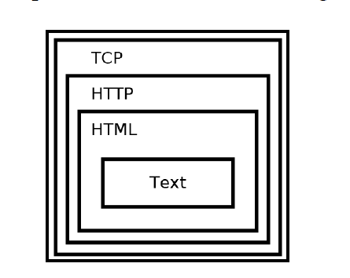
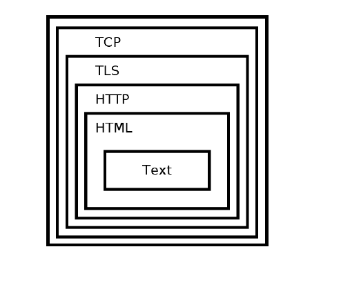
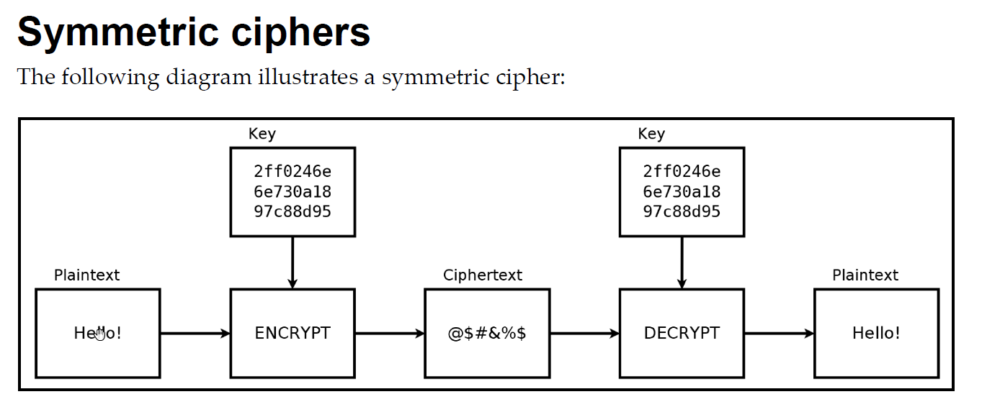
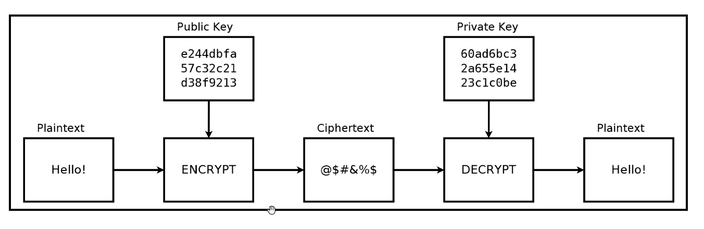
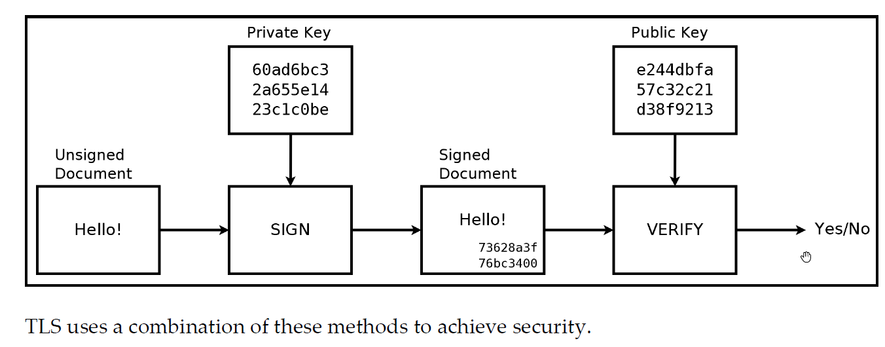
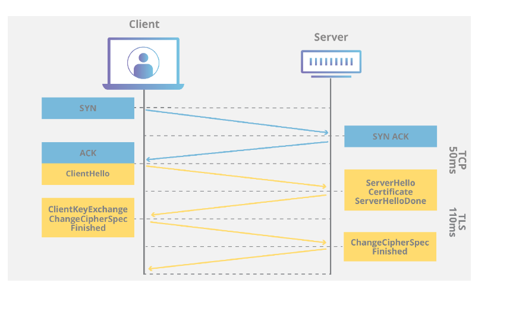

In this module, we'll learn how to initiate secure connections to web servers using Hypertext Transfer Protocol Secure (HTTPS).

Resources:
1 - Hands-On Network Programming in C - Packt. By Lewis Van Winkle Chapter 9.
2 - Foundations of Python Programming. Chapter 6.
3 - https://www.cloudflare.com/learning/ssl/what-is-https/
4 - https://www.semrush.com/blog/what-is-https/

//provide links on encryption, TLS, OpenSSL.

The following topics are covered in this chapter:
    Background information about HTTPS
    Types of encryption ciphers
    How servers are authenticated
    Basic OpenSSL usage

What is HTTPS?
What problem does HTTPS attempt to solve?
HTTPS technical details/How does HTTPS work?

What is TLS?
What does TLS protect?
What does TLS Fail to protect?
Type of encryption schemes use?
Symmetric vs Asymetric?

Openssl

SSL Socket API.
Implement an HTTPS server + client.

***************************************************************************************************************************************
HTTPS Overview:

What is HTTPS?
    A quick definition: HTTPS stands for hypertext transfer protocol secure and is the encrypted version of HTTP. It is used for secure communication across the internet or a network. The communication protocol is encrypted using Transport Layer Security (TLS) or, formerly, Secure Sockets Layer (SSL). HTTPS uses (typically) TCP port 443 while HTTP uses port 80.
        https://www.semrush.com/blog/what-is-https/

HTTPS technical details:

How does HTTPS work?

    From : https://www.cloudflare.com/learning/ssl/what-is-https/
    HTTPS uses an encryption protocol to encrypt communications. The protocol is called Transport Layer Security (TLS), although formerly it was known as Secure Sockets Layer (SSL). This protocol secures communications by using what’s known as an asymmetric public key infrastructure. This type of security system uses two different keys to encrypt communications between two parties:
        
        *   The private key - this key is controlled by the owner of a website and it’s kept, as the reader may have speculated, private. This key lives on a web server and is used to decrypt information encrypted by the public key.

        *   The public key - this key is available to everyone who wants to interact with the server in a way that’s secure. Information that’s encrypted by the public key can only be decrypted by the private key.

    *   SSL and TLS are compatible, the information covered in this module applies to both.

Hands-On Network Programming in C - Packt. By Lewis Van Winkle Chapter 9.

    Generally, establishing an HTTPS connection involves the client and server negotiating which protocol to use. The ideal outcome is that the client and server agree on the most secure, mutually supported protocol and cipher.

Protocol security aims to address the following three things:
    
    *   Authentication: We need a way to prevent impostors from posing as legitimate communication partners. TLS provides peer authentication methods for this reason.

    *   Encryption: TLS uses encryption to obfuscate transmitted data. This prevents an eavesdropper from correctly interpreting intercepted data.

    *   Integrity: TLS also ensures that received data has not been tampered with or otherwise forged.

At a high level, this is how HTTP and HTTPS differ from each other and how TLS/SSL work to secure HTTPS.

Recal, HTTP is commonly used to transmit web pages using Hypertext Markup Language (HTML) and TCP is used as the mechanism to deliver web pages from a server to a client.

Visual representation of an HTTP session encapsulation:

How does TLS/SSL protect HTTP?
    * TLS works inside TCP to provide a secure communication channel for for HTTP.
    
    * These are the steps followed by an HTTPS session:
      1.  HTTPS sets up the usual TCP session, 3-way handshake.
      2.  TLS takes over the connection and sets up the TLS/SSL handshake, cipher and certificate exchange, and secures the TCP session.
      3.  HTTP takes over and proceeds as normal through the TLS/SSL encrypted channel.
  
    * HTTPS adds additional headers to HTTP, known as HTTPS headers.
 

Visual representation of an HTTPS session encapsulation:

We'll cover TLS in detail shortly, but we'll briefly answer the two following questions:

From: Foundations of Python Programming. Chapter 6, pages: 93-95
What does TLS protect?
    TLS aims to protect the data transmitted over an encrypted channel. To anyone intercepting our traffic, the data will appear as gibberish.

What does TLS Fail to protect?
    Before a secure TLS connection can be setup, the client and server need to perform a DNS lookup and set up a regular TCP channel.
    That means, anyone monitoring our connection will be able to see:
        
        * DNS request made by the client to learn the server's IP address.
        * Both the client and server's IP address and port.
        * The size of the chunk of data being transmitted in both direction.

HTTPS connections are first made using TCP sockets. Once the TCP connection is established, OpenSSL is used to negotiate a TLS connection over the open TCP connection. From that point forward, OpenSSL functions are used to send and receive data over the TLS connection.

Overview of an HTTPS session setup:

1. Client makes DNS request for the hostname/IP address of server.
2. TCP connection is established: 3-way handshake.
3. TLS/HTTPS protocol initiation takes over.
4. Client (TLS) requests a certificate from the server; The certificate includes a public key.
5. Server responds with the requested information.
6. Client verifies identify of the server by verifying validity of the certificate.
7. If everything checks out, HTTPS session is completed and secured communication can commence.
8. TLS session is torn-down.
9. TCP connection is closed: 4-way close-down process.

Before we can dig into TLS, we need to cover some necessary background information on encryption.

Encryption Basics:

What is encryption?
    Encryption is a method of encoding data so that only authorized parties can access it.

    Encryption does not prevent interception or interference of data or communication channels but it does prevent the attackers from reading the data.

What are ciphers?
    Encryption algorithms are called ciphers.
    A cipher takes plaintext as its input and produces an encrypted output, known as ciphertext.

    Encryption is the process of using ciphers to produce ciphertext from plaintext.
    
    Decryption is the process of taking ciphertext and producing plaintext by reversing the process of encryption.

Different types of encryption:
There are different types of encryption algorithms but for the purpose of this module we'll focus on symmetric and asymmetric encryption.

Symmetric:
https://www.cryptomathic.com/news-events/blog/symmetric-key-encryption-why-where-and-how-its-used-in-banking
https://learn.microsoft.com/en-us/windows/win32/seccrypto/cryptographic-keys
https://www.trentonsystems.com/blog/symmetric-vs-asymmetric-encryption

    *   A single key that is used for both encryption and decryption.
    *   The same key is known to/shared by both parties, sender and receiver.
    *   Faster than asymmetric, public key algorithms.
    *   The key must be shared, securely, between parties.

    Issues:
        One issue with symmetric encryption is that the same key must be known to both the sender and receiver. This introduces the problem of securely transmmitting the key between the parties involved.

    Common symmetric key algorithms:
        * RC4
        * DES (Data Encryption Standard)
        * AES (Advanced Encryption Standard)

Illustration of Symmetric ciphers:

Key-Exchange Algorithms: Used to solve the problem of secured key-exchange with symmetric encryption.
    Key exchange (also key establishment) is a method in cryptography by which cryptographic keys are exchanged between two parties, allowing use of a cryptographic algorithm.
    https://en.wikipedia.org/wiki/Key_exchange

    
Asymmetric:
https://learn.microsoft.com/en-us/windows/win32/seccrypto/public-private-key-pairs
https://www.trentonsystems.com/blog/symmetric-vs-asymmetric-encryption

    * Also known as public-key encryption, attempts to solve the key and authentication problems of symmetric encryption. 
    * A set of public/private key pairs are used for encryption/decryption.
    * Private key is kept secured and only known to one party, used to decrypt data.
    * Public key can be shared with other parties, used to encrypt data.
    * Anyone can use the public key to encrypt a message but only the recepient can decrypt the message using the private key.
    * Mainly used to encrypt/decrypt session keys (symmetric encryption keys) and digital signatures.
    * Asymmetric encryption is slower than symmetric encryption.

    Common Asymmetric key algorithms: https://en.wikipedia.org/wiki/Public-key_cryptography
        * RSA
        * ECC (Elliptic Curve Cryptography)
        * Diffie-Hellman
        * DSA

Digital Signatures:
     * Used to verify the authenticity of data.
     * Created by using a private key to generate a signature for a document or piece of data.
     * The public key can then be used to verify that the document was signed by the holder of the private key.

How TLS uses Ciphers:
    *   During the TLS handshake, clients will request a certificate to verify authenticity of the server.
    *   TLS uses digital signatures to authenticate the identify of the server.
    *   Commonly, the server's identity is verified but not the client's.

Recall, that Asymmetric key algorithms are inneficient and only able to protect small blocks/amounts of data. Symmetric keys on the other hand, are much faster and able to encrypt larger quantity of data. For this reason, TLS uses Asymmetric encryption to perform the public key exchange of the symmetric keys, and uses symmetric encryption to encrypt the actual data transmitted over HTTPS. TLS also uses Asymmetric key to authenticate the server.

TLS versions:
    *   There are multiple versions of TLS, with the latest one being TLS 1.3.
    *   Each new version aims to fix known vulnerabilities.
    *   Older browsers and clients might not be able to support newer encryption mechanisms.
    *   When a client first attempts to establish a TLS connection, the client will send a list of preferred cipher suites to the server and the server will select a cipher based on the protocol version/cipher suites it can support.
    *   Only when the client and server agree upon a given cipher suite, can the TLS connection be established.

With all the basics out of the way, we can now discuss TLS in more detail.

The TLS Protocol:
There are plenty of resources on the subject, a handful of recommended resources are listed here:

    Foundations of Python Programming. Chapter 6, pgs: 94-95
    Hands-On Network Programming in C - Packt. By Lewis Van Winkle Chapter 9, pg: 263
    
    Cloudflare provides a quick overview of TLS, including the TLS handshake: 
    https://www.cloudflare.com/learning/ssl/transport-layer-security-tls/

    More in-depth documentation
    TLS 1.2 RFC:
    https://datatracker.ietf.org/doc/html/rfc5246

    This site has a really good visual description of the TLS handshake and each step in the process: 
    https://tls13.xargs.org/
    https://tls12.xargs.org/

How does TLS work?

TLS Handshake:
https://www.cloudflare.com/learning/ssl/transport-layer-security-tls/

Text was taken from: https://www.internetsociety.org/deploy360/tls/basics/

    TLS uses a combination of symmetric and asymmetric cryptography, as this provides a good compromise between performance and security when transmitting data securely.

    With symmetric cryptography, data is encrypted and decrypted with a secret key known to both sender and recipient; typically 128 but preferably 256 bits in length (anything less than 80 bits is now considered insecure). Symmetric cryptography is efficient in terms of computation, but having a common secret key means it needs to be shared in a secure manner.

    Asymmetric cryptography uses key pairs – a public key, and a private key. The public key is mathematically related to the private key, but given sufficient key length, it is computationally impractical to derive the private key from the public key. This allows the public key of the recipient to be used by the sender to encrypt the data they wish to send to them, but that data can only be decrypted with the private key of the recipient.

    The advantage of asymmetric cryptography is that the process of sharing encryption keys does not have to be secure, but the mathematical relationship between public and private keys means that much larger key sizes are required. The recommended minimum key length is 1024 bits, with 2048 bits preferred, but this is up to a thousand times more computationally intensive than symmetric keys of equivalent strength (e.g. a 2048-bit asymmetric key is approximately equivalent to a 112-bit symmetric key) and makes asymmetric encryption too slow for many purposes.

    For this reason, TLS uses asymmetric cryptography for securely generating and exchanging a session key. The session key is then used for encrypting the data transmitted by one party, and for decrypting the data received at the other end. Once the session is over, the session key is discarded.

    A variety of different key generation and exchange methods can be used, including RSA, Diffie-Hellman (DH), Ephemeral Diffie-Hellman (DHE), Elliptic Curve Diffie-Hellman (ECDH) and Ephemeral Elliptic Curve Diffie-Hellman (ECDHE). DHE and ECDHE also offer forward secrecy whereby a session key will not be compromised if one of the private keys is obtained in future, although weak random number generation and/or usage of a limited range of prime numbers has been postulated to allow the cracking of even 1024-bit DH keys given state-level computing resources. However, these may be considered implementation rather than protocol issues, and there are tools available to test for weaker cipher suites.

    With TLS it is also desirable that a client connecting to a server is able to validate ownership of the server’s public key. This is normally undertaken using an X.509 digital certificate issued by a trusted third party known as a Certificate Authority (CA) which asserts the authenticity of the public key. In some cases, a server may use a self-signed certificate which needs to be explicitly trusted by the client (browsers should display a warning when an untrusted certificate is encountered), but this may be acceptable in private networks and/or where secure certificate distribution is possible. It is highly recommended though, to use certificates issued by publicly trusted CAs

What is a certificate Authority (CA)? https://www.internetsociety.org/deploy360/tls/basics/

    A Certificate Authority (CA) is an entity that issues digital certificates conforming to the ITU-T’s X.509 standard for Public Key Infrastructures (PKIs). Digital certificates certify the public key of the owner of the certificate (known as the subject), and that the owner controls the domain being secured by the certificate. A CA therefore acts as a trusted third party that gives clients (known as relying parties) assurance they are connecting to a server operated by a validated entity.

    End entity certificates are themselves validated through a chain-of-trust originating from a root certificate, otherwise known as the trust anchor. With asymmetric cryptography it is possible to use the private key of the root certificate to sign other certificates, which can then be validated using the public key of the root certificate and therefore inherit the trust of the issuing CA. In practice, end entity certificates are usually signed by one or more intermediate certificates (sometimes known as subordinate or sub-CAs) as this protects the root certificate in the event that an end entity certificate is incorrectly issued or compromised.

    Root certificate trust is normally established through physical distribution of the root certificates in operating systems or browsers. The main certification programs are run by Microsoft (Windows & Windows Phone), Apple (OSX & iOS) and Mozilla (Firefox & Linux) and require CAs to conform to stringent technical requirements and complete a WebTrust, ETSI EN 319 411-3 (formerly TS 102 042) or ISO 21188:2006 audit in order to be included in their distributions. WebTrust is a programme developed by the American Institute of Certified Public Accountants and the Canadian Institute of Chartered Accountants, ETSI is the European Telecommunications Standards Institute, whilst ISO is the International Standards Organisation.

    Root certificates distributed with major operating systems and browsers are said to be publicly or globally trusted and the technical and audit requirements essentially means the issuing CAs are multinational corporations or governments. There are currently around fifty publicly trusted CAs, although most/all have more than one root certificate, and most are also members of the CA/Browser Forum which develops industry guidelines for issuing and managing certificates.

    It is however also possible to establish private CAs and establish trust through secure distribution and installation of root certificates on client systems. Examples include the RPKI CAs operated by the Regional Internet Registries (AfriNIC, APNIC, ARIN, LACNIC and RIPE NCC) that issue certificates to Local Internet Registries attesting to the IP addresses and AS numbers they hold; as well as the International Grid Trust Federation (IGTF) which provides a trust anchor for issuing server and client certificates used by machines in distributed scientific computing. In these cases, the root certificates can be securely downloaded and installed from sites using a certificate issued by a publicly trusted CA.

    One weakness with the X.509 PKI system is that third parties (CAs) are able to issue certificates for any domain, whether or not the requesting entity actually owns or otherwise controls it. Validation is typically performed through domain validation – namely sending an e-mail with an authentication link to an address known to be administratively responsible for the domain. This is usually one of the standard contact addresses such as ‘hostmaster@domain’ or the technical contact listed a WHOIS database, but this leaves itself open to man-in-the-middle attacks on the DNS or BGP protocols, or more simply, users registering administrative addresses on domains that have not been reserved. Perhaps more importantly, Domain Validated (DV) certificates do not assert that a domain has any relationship with a legal entity, even though a domain may appear to have one.

    For this reason, CAs are increasingly encouraging the use of Organisation Validated (OV) and Extended Validation (EV) certificates. With OV certificates, the requesting entity is subject to additional checks such as confirmation of organisation name, address and telephone number using public databases. With EV certificates, there are additional checks on legal establishment, physical location, and the identity of the individuals purporting to act on behalf of the requesting entity.

    Of course, this still does not prevent CAs accidentally or fraudulently issuing incorrect certificates, and there have also been incidents of security breaches where CAs were tricked into issuing fake certificates. Despite substantial tightening up of security procedures in the wake of several high-profile incidents, the system remains reliant on third party trust which has led to the development of the DNS-based Authentication of Named Entities (DANE) protocol as specified in RFCs 6698, 7671, 7672 and 7673.

    With DANE, a domain administrator can certify their public keys by storing them in the DNS, or alternatively specifying which certificates should be accepted by a client. This requires the use of DNSSEC which cryptographically asserts the validity of DNS records, although DNSSEC does not yet have widespread deployment and major browsers currently require installation of an add-on in order to support DANE. Moreover, DNSSEC and DANE will still require validation of domain holders that will likely have to be undertaken by domain registries and/or registrars instead of CAs.

OpenSSL: https://www.openssl.org/docs/
    OpenSSL is a widely used open source library that provides SSL and TLS services to applications.
    We'll use OpenSSL to provide TLS support and implement HTTPS for our programs.
   
We've covered the necessary background information to allow us to write both an HTTPS client and server. We'll cover additional information required for both clients and servers in their respective modules.