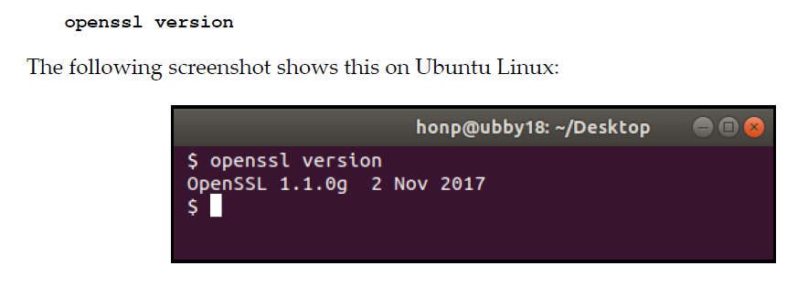

Module 7.2 – HTTPS clients

In this module we will cover how to write a simple HTTPS client and how to use the OpenSSL library to provide TLS support for our client program.


Module 7.2 Required Reading Material: 

•	[1] Lewis Van Winkle, “Hands-On Network Programming with C". Packt Publishing. May 2019. ISBN: 9781789349863. https://learning.oreilly.com/library/view/hands-on-network-programming/9781789349863/
    o	Read chapter 9.

•	[2] Brandon Rhodes, John Goerzen, “Foundations of Python Network Programming, Third Edition”. Apress. August 2014. https://learning.oreilly.com/library/view/foundations-of-python/9781430258551/
    o	Read chapter 6. 

*For this module we will have our notes saved as a .txt or .md (markdown) file since instead of the usual .docx format. It makes it easier to view/read, and search through the code. 
OpenSSL
To determine if OpenSSL is installed on your systems, run the following command on a terminal:
#openssl version

your output should look similar to this on an Ubuntu/Debian based system:


You will also need to ensure that  you have the OpenSSL library installed on your system. Compile and run the following program to test whether it is installed:
Refer to Hands-On Network Programming in C - Packt. By Lewis Van Winkle Chapter 9, pages: 266-267.

In order to use OpenSSL in your C code, you need to install the following package from a terminal:

#sudo apt install libssl-dev

**You might need to re-open your code editor for the changes to be detected.

Required libraries/header files:

#include <OpenSSL/crypto.h>
#include <OpenSSL/x509.h>
#include <OpenSSL/pem.h>
#include <OpenSSL/ssl.h>
#include <OpenSSL/err.h>

```
/*OpenSSL_version.c*/

#include <OpenSSL/ssl.h>
int main(int argc, char *argv[])
{
    printf("OpenSSL version: %s\n", OpenSSL_version(SSLEAY_VERSION));
    return 0;
}

```

Compile:
#Need to run gcc with arguments in this order. Linking broke for some reason if I didn't follow this order.

gcc OpenSSL_version.c -o OpenSSL_version -lcrypto

Run:
./OpenSSL_version

Programming with OpenSSL: SSL functions/API:

https://www.OpenSSL.org/docs/man3.0/man7/crypto.html
https://www.feistyduck.com/library/OpenSSL-cookbook/online/
https://www.OpenSSL.org/docs/man1.1.1/man3/

These were the best resource I could find as far as documentation of the SSL API: 
https://www.OpenSSL.org/docs/man1.1.1/man7/ssl.html
https://www.OpenSSL.org/docs/man3.1/man7/ssl.html
https://www.OpenSSL.org/docs/man3.2/man7/ssl.html


Refer to Hands-On Network Programming in C - Packt. By Lewis Van Winkle Chapter 9, pages: 266-279.

#need to linke with -lcrypto and lssl if using any of the SSL* functions.

gcc OpenSSL_version.c -o OpenSSL_version -lcrypto -lssl
###

Recall, HTTPS connections are first made using TCP sockets. Once the TCP connection is established, OpenSSL is used to negotiate a TLS connection over the open TCP connection. From that point forward, OpenSSL functions are used to send and receive data over the TLS connection.


Overview of an HTTPS session setup:

1. Client makes DNS request for the hostname/IP address of server.
2. TCP connection is established: 3-way handshake.
3. TLS/HTTPS protocol initiation takes over.
4. Client (TLS) requests a certificate from the server; The certificate includes a public key.
5. Server responds with the requested information.
6. Client verifies identify of the server by verifying validity of the certificate.
7. If everything checks out, the HTTPS session has completed, and secure communication can commence.
8. TLS session is torn down.
9. TCP connection is closed: 4-way close-down process.

##

TLS provided by OpenSSL can be applied to any TCP socket.

OpenSSL API:

Before using OpenSSL in your program, you need to initialize it, load the supported algorithms, and SSL error support functions.

Step 1: Initialize OpenSSL

SSL_library_init(): 
    https://www.OpenSSL.org/docs/manmaster/man3/SSL_library_init.html

    Initialize SSL library by registering algorithms.
    Params:
        None:
    
    Returns:
        SSL_library_init() always returns “1”, so it is safe to discard the return value.

OpenSSL_add_all_algorithms():
https://www.OpenSSL.org/docs/man1.1.1/man3/OpenSSL_add_all_algorithms.html

        OpenSSL keeps an internal table of digest algorithms and ciphers. It uses this table to lookup ciphers via functions such as EVP_get_cipher_byname().

        OpenSSL_add_all_algorithms() adds all algorithms to the table (digests and ciphers).

    Params: N/A
    Returns: N/A

SSL_load_error_strings():
https://www.OpenSSL.org/docs/man3.0/man3/SSL_load_error_strings.html

    ERR_load_crypto_strings() registers the error strings for all libcrypto functions.
    
    Params: N/A
    Returns: N/A


Step 2: Create an SSL context

Once OpenSSL has been initialized, we are ready to create an SSL context.

    What's an SSL context? https://www.OpenSSL.org/docs/man3.0/man7/ssl.html

    An SSL_CTX object is created as a framework to establish TLS/SSL enabled connections (see SSL_CTX_new(3)). Various options regarding certificates, algorithms etc. can be set in this object.

SSL_CTX *ctx = SSL_CTX_new(TLS_client_method())
    https://www.OpenSSL.org/docs/man3.0/man3/SSL_CTX_new.html

    SSL_CTX_new() creates a new SSL_CTX object, which holds various configuration and data relevant to SSL/TLS or DTLS session establishment. These are later inherited by the SSL object representing an active session.

    Params:
        TLS_client_method(): The method parameter specifies whether the context will be used for the client or server side or both.

        Note:
            TLS_client_method(), indicates that we want general-purpose, version-flexible TLS methods available. Our client  automatically negotiates the best mutually supported algorithm with the server upon connecting.

    Returns:
        NULL
            The creation of a new SSL_CTX object failed. Check the error stack to find out the reason.

        Pointer to an SSL_CTX object
            The return value points to an allocated SSL_CTX object.
            SSL_CTX_up_ref() returns 1 for success and 0 for failure.

TLS_client_method()
https://www.OpenSSL.org/docs/man3.0/man3/TLS_client_method.html
    These are the general-purpose version-flexible SSL/TLS methods. The actual protocol version used will be negotiated to the highest version mutually supported by the client and the server. The supported protocols are SSLv3, TLSv1, TLSv1.1, TLSv1.2 and TLSv1.3. Applications should use these methods, and avoid the version-specific methods described below, which are deprecated.


Step 3: Create a TCP connection.

After initializing OpenSSL and creating an SSL context, we proceed to create a TCP connection in the normal way (refer to Module 2):
    getaddrinfo()
    socket()
    connect()

Step 4: Initiate a TLS connection.

Once connect() has completed and we've established a TCP connection, we can initiate a TLS connection.
    
SSL *ssl = SSL_new(ctx)
    https://www.OpenSSL.org/docs/man3.0/man3/SSL_new.html
        
    SSL_new() creates a new SSL structure which is needed to hold the data for a TLS/SSL connection.
        
    The returned object is used to track the new SSL/TLS connection.

    Parms:
        ctx is the context returned in step 2 by calling SSL_CTX_new();

    Returns:
        NULL
            The creation of a new SSL structure failed. Check the error stack to find out the reason.

        Pointer to an SSL structure
            The return value points to an allocated SSL structure.
            SSL_up_ref() returns 1 for success and 0 for failure.


SSL_set_tlsext_host_name(ssl, hostname)
    https://www.OpenSSL.org/docs/man1.1.1/man3/SSL_set_tlsext_host_name.html

    Sets the server’s name indication ClientHello extension to contain the value name

    Params:
        ssl: ssl connection structure/object.
        hostname: the domain for the server we are trying to connect to. (This sets the SNI field)
        
    Returns:
        Returns 1 on success, 0 in case of error.
    
    Notes:
        The SSL_set_tlsext_host_name() function should only be called on SSL objects that will act as clients; otherwise, the configured name will be ignored.

SSL_set_fd(ssl, socket)
    https://www.OpenSSL.org/docs/manmaster/man3/SSL_set_fd.html

    SSL_set_fd() sets the file descriptor fd as the input/output facility for the TLS/SSL (encrypted) side of ssl. fd will typically be the socket file descriptor of a network connection.

    Params:
        ssl: ssl connection structure/object.
        fd: socket file descriptor for a network connection.

    Returns:
        0 on failure, 1 on success.

SSL_connect(ssl)
https://www.OpenSSL.org/docs/man1.0.2/man3/SSL_connect.html

    Initiate the TLS/SSL handshake with an TLS/SSL server. The communication channel must already have been set and assigned to the ssl by setting an underlying BIO.

    Params:
        ssl: ssl connection structure/object.

    Returns:
        0
            The TLS/SSL handshake was not successful but was shut down controlled and by the specifications of the TLS/SSL protocol. Call SSL_get_error() with the return value ret to find out the reason.

        1
            The TLS/SSL handshake was successfully completed, a TLS/SSL connection has been established.

        <0
            The TLS/SSL handshake was not successful, because a fatal error occurred either at the protocol level or a connection failure occurred. The shutdown was not clean. It can also occur of action is need to continue the operation for non-blocking BIOs. Call SSL_get_error() with the return value ret to find out the reason.


SSL_get_cipher(ssl):
https://www.OpenSSL.org/docs/man1.0.2/man3/SSL_get_cipher.html
    
    Gets the name of the currently used cipher.

    Params:
        ssl: ssl connection structure/object.
    Returns:
        SSL_get_current_cipher() returns the cipher actually used or NULL, when no session has been established.


Step 5: Send/Receive Data.

Once the TLS connection is established, data can be sent and received using SSL_write() and SSL_read(), respectively. These functions are used in a nearly identical manner as the standard socket send() and recv() functions.

SSL_write():
https://www.OpenSSL.org/docs/man1.1.1/man3/SSL_write.html

int SSL_write(SSL *ssl, const void *buf, size_t num, size_t *written);
    SSL_write() write num bytes from the buffer buf into the specified ssl connection. On success SSL_write() will store the number of bytes written in *written.

    Params:
        ssl: ssl connection structure/object.
        
        *buf: Data buffer containing to be sent.

        num: number of bytes from buf to write into the *ssl connection.

        written: will store the number of bytes written into *ssl.

    Returns:
        For SSL_write() the following return values can occur:

        > 0
        The write operation was successful, the return value is the number of bytes actually written to the TLS/SSL connection.

        <= 0
        The write operation was not successful, because either the connection was closed, an error occurred, or action must be taken by the calling process. Call SSL_get_error() with the return value ret to find out the reason.


SSL_read()
https://www.OpenSSL.org/docs/man1.1.1/man3/SSL_read.html

 int SSL_read_ex(SSL *ssl, void *buf, size_t num, size_t *readbytes);
 int SSL_read(SSL *ssl, void *buf, int num);


    SSL_read_ex() and SSL_read() try to read num bytes from the specified ssl into the buffer buf. On success SSL_read_ex() will store the number of bytes actually read in *readbytes.

    Params:
        See man page.

    Returns:
        See man page.

Step 6: Tear down SSL connection, TCP socket, and free SSL resources.
##
SSL_shutdown(ssl);
close(socket);
SSL_free(ssl);
##

close(socket): already covered.


SSL_shutdown(ssl)
https://www.OpenSSL.org/docs/manmaster/man3/SSL_shutdown.html
    Shuts down a TLS/SSL connection.

    Params:
        ssl: ssl connection structure/object.

    Returns:
        See man page.

SSL_free(ssl);
https://www.OpenSSL.org/docs/man1.1.1/man3/SSL_free.html
    SSL_free() decrements the reference count of ssl, and removes the SSL structure pointed to by ssl and frees up the allocated memory if the reference count has reached 0. If ssl is NULL nothing is done.

    Params:
        ssl: ssl connection structure/object.

    Returns:
        N/A

Step 7: free SSL_CTX.

SSL_CTX_free(ctx)
https://www.OpenSSL.org/docs/man1.0.2/man3/SSL_CTX_free.html
    
    Frees an allocated SSL_CTX object.

    SSL_CTX_free() decrements the reference count of ctx, and removes the SSL_CTX object pointed to by ctx and frees up the allocated memory if the reference count has reached 0.

    Params:
        ctx: A previously allocated SSL_CTX object.
    
    Returns:
        N/A.


Certificate Functions/APIs:
    Once a TLS connection is established, we can retrieve and verify the server's certificate.


Step 8: Print certificate subject and issues.


X509 *cert = SSL_get_peer_certificate(ssl)
[ X509 *SSL_get_peer_certificate(const SSL *ssl)]
https://www.OpenSSL.org/docs/man1.1.1/man3/SSL_get_peer_certificate.html
    Gets the X509 certificate of the peer.
    SSL_get_peer_certificate() returns a pointer to the X509 certificate the peer presented. If the peer did not present a certificate, NULL is returned.

    Params:
        ssl: ssl connection structure/object.

    Returns:
        NULL
            No certificate was presented by the peer, or no connection was established.

        Pointer to an X509 certificate
            The return value points to the certificate presented by the peer.


char * X509_NAME_oneline(X509_NAME *a,char *buf,int size);

#X509_NAME_oneline(X509_get_subject_name(cert), 0, 0)

    https://www.OpenSSL.org/docs/man1.0.2/man3/X509_NAME_oneline.html
    X509_NAME_oneline() prints an ASCII version of a to buf. If buf is NULL then a buffer is dynamically allocated and returned, and size is ignored. Otherwise, at most size bytes will be written, including the ending ‘\0’, and buf is returned.
    
    Params:
        see man page.
    Returns:
        see man page.


X509_NAME *X509_get_subject_name(const X509 *x);
https://www.OpenSSL.org/docs/man1.1.1/man3/X509_get_subject_name.html

    X509_get_subject_name() returns the subject name of certificate x. The returned value is an internal pointer which MUST NOT be freed.
    
    Params:
        see man page.
    Returns:
        see man page.
    
X509_NAME *X509_get_issuer_name(const X509 *x)
https://www.OpenSSL.org/docs/man3.0/man3/X509_get_issuer_name.html
    
    This function is similar to *X509_get_subject_name().

    Params:
        see man page.
    Returns:
        see man page.
    

OPENSSL_free(tmp)
https://www.OpenSSL.org/docs/man3.0/man3/OPENSSL_free.html
    Used to free memory that was previously allocated by OpenSSL functions.
    Similar to the standard library's free().

X509_free(cert)
https://www.OpenSSL.org/docs/man3.1/man3/X509_free.html
    
    X509_free() decrements the reference count of a X509 structure and frees it up if the reference count is zero. If a is NULL nothing is done


Step 9: Verify the certificate during the TLS/SSL handshake.

SSL_get_verify_result(ssl)
https://www.OpenSSL.org/docs/man1.0.2/man3/SSL_get_verify_result.html
    SSL_get_verify_result() returns the result of the verification of the X509 certificate presented by the peer, if any.

    Params:
        ssl: ssl connection structure/object.
    
    Returns:
        The following return values can currently occur:

        X509_V_OK
            The verification succeeded or no peer certificate was presented.

        Any other value
            Documented in verify(1).

    Notes:
        If SSL_get_verify_result() returns X509_V_OK, then the certificate chain was verified by OpenSSL and the connection can be trusted. If SSL_get_verify_result() does not return X509_V_OK, then HTTPS authentication has failed, and the connection should be abandoned.

In order for OpenSSL to successfully verify the certificate, we must tell it which certificate authorities we trust.

SSL_CTX_load_verify_locations()
https://www.OpenSSL.org/docs/man3.0/man3/SSL_CTX_load_verify_locations.html
    int SSL_CTX_load_verify_dir(SSL_CTX *ctx, const char *CApath);

    Params:
        ssl: ssl connection structure/object.

        CApath: path to CA store or .pem key/file.
    Returns:
        See man page.

We are now ready to implement a simple HTTPS client. See https_simple.c in the module's source code directory.

Comparing our program's behavior against OpenSSL's utility to make sure it is properly implemented.

Make sure the following are properly implemented:
    1. TCP handshake is set up the same way.
    2. TSL take-over and TLS handshake.
    3. TLS Session tear-down.
    4. TCP session teardown.

See https_client.c for a sample programming implementing the functions discussed.
