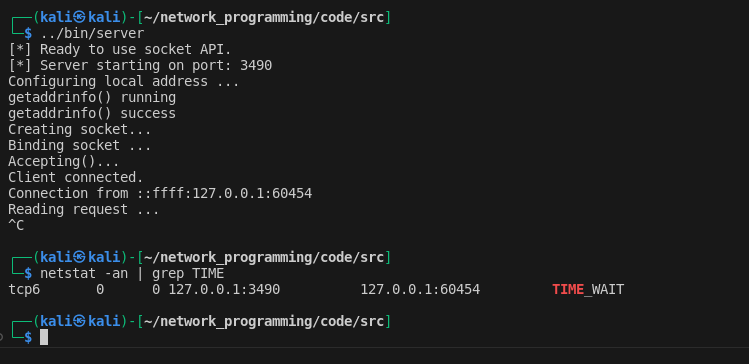

This module explores the topic of Socket Options in network programming.

•	[3] W. Richard Stevens, Bill Fenner, Andrew M. Rudoff, “The Sockets Networking API: UNIX® Network Programming Volume 1, Third Edition”. Addison Wesley. November 2003. ISBN: 0-13-141155-1. https://learning.oreilly.com/library/view/the-sockets-networking/0131411551/

    o	This book provides a more in-depth/technical explanation for the topics covered in this module. 
    o	Read chapter 7.

•	[2] Lewis Van Winkle, “Hands-On Network Programming with C". Packt Publishing. May 2019. ISBN: 9781789349863. https://learning.oreilly.com/library/view/hands-on-network-programming/9781789349863/
    o	Read chapter 13 - Preventing address-in-use errors.


https://www.ibm.com/docs/en/aix/7.2?topic=sockets-socket-options


In addition to binding a socket to a local address or connecting it to a destination address, application programs need a method to control the socket. For example, when using protocols that use time out and retransmission, the application program may want to obtain or set the time-out parameters.

An application program may also want to control the allocation of buffer space, determine if the socket allows transmission of broadcast, or control processing of out-of-band data (see Out-of-Band Data). The ioctl-style getsockopt and setsockopt subroutines provide the means to control socket operations. The getsockopt subroutine allows an application program to request information about socket options. The setsockopt subroutine allows an application program to set a socket option using the same set of values obtained with the getsockopt subroutine. Not all socket options apply to all sockets. The options that can be set depend on the current state of the socket and the underlying protocol being used.

In this module, we'll explore the following functions:
    getsockopt()
    setsockopt()
    fcntl()
    ioctl()


##
getsockopt and setsockopt are used to get and set options on sockets, respectively.


The getsockopt() function:
    
    Description:
        Used to retrieve options associated with a socket. It allows you to query various properties of a socket, such as its status, settings, or configuration. 

    Signature:
    int getsockopt(int sockfd, int level, int optname,void optval[restrict *.optlen],
                socklen_t *restrict optlen)

    Parameters:
        sockfd: Refers to an open socket descriptor.

        level: This specifies the protocol level at which the option resides. Common levels include SOL_SOCKET for socket-level options and protocol-specific levels for options related to a specific protocol (e.g., IPPROTO_TCP for TCP options).

        optname: The socket option for which the value is to be retrieved. 

        optval: A pointer to the buffer in which the value for the requested option is to be returned.

        optlen: A pointer to the size, in bytes, of the optval buffer.

The setsockopt() function:
    
    Description:
         used to set options associated with a socket. It allows you to configure various properties of a socket, such as its behavior, settings, or configuration.

    Signature:
    int setsockopt(int sockfd, int level, int optname, const void optval[.optlen],
                      socklen_t optlen);

    Parameters:
        sockfd: Refers to an open socket descriptor.

        level: This specifies the protocol level at which the option resides. Common levels include SOL_SOCKET for socket-level options and protocol-specific levels for options related to a specific protocol (e.g., IPPROTO_TCP for TCP options).

        optname: The specific option you want to retrieve. This can be a predefined constant like SO_RCVBUF (receive buffer size) or SO_REUSEADDR (allow reuse of local addresses).

        optval: A pointer to a memory location where the value of the option will be stored.

        optlen: A pointer to an integer that specifies the size of the memory pointed to by optval. Upon successful completion, it contains the actual size of the option value.


For a list of options that can be queried by getsockopt or set by setsockopt, see chapter 7 from: Unix Network Programming. Pages: 241-242. The figures difficult to see, I recommend going to: https://notes.shichao.io/unp/ch7/ for better quality images. The author of the side does a really good job of listing out all the options in a table, which makes searching through the document a lot easier. Additionally, you can read through tsocket(7) man page (man 7 socket) on any unix system to get more information about the supported socket options and respective values. 

Read Chapter 7 from Unix Network Programming for more information on the subject.


Preventing address-in-use errors
•	[2] Lewis Van Winkle, “Hands-On Network Programming with C". Packt Publishing. May 2019. ISBN: 9781789349863. https://learning.oreilly.com/library/view/hands-on-network-programming/9781789349863/
    o	Read chapter 13 - Preventing address-in-use errors.


Throughough the modules, we've experienced the issue where we kill our server program, try to run it right away only to get an "Address in Use" error. We can use socket options to help us get around this issue.

```C 
    int yes = 1;
    if (setsockopt(my_socket, SOL_SOCKET, SO_REUSEADDR,
    (void*)&yes, sizeof(yes)) < 0) {
        fprintf(stderr, "setsockopt() failed. (%d)\n", GETSOCKETERRNO());
    }

```

Once the SO_REUSEADDR flag is set, bind() succeeds even if a few TIME-WAIT connections are still hanging on to the same local port and address.

Why do we get this error?
Essentially, when an application initiates a TCP socket close (or causes the disconnection by crashing), that socket goes into the TIME-WAIT state. The operating system continues to keep track of this socket for some time, potentially minutes.

You can reproduce this error by running one of our TCP server programs, killing the process, and run netstat -an | grep TIME and look for the TIME_WAIT state in our connection.



